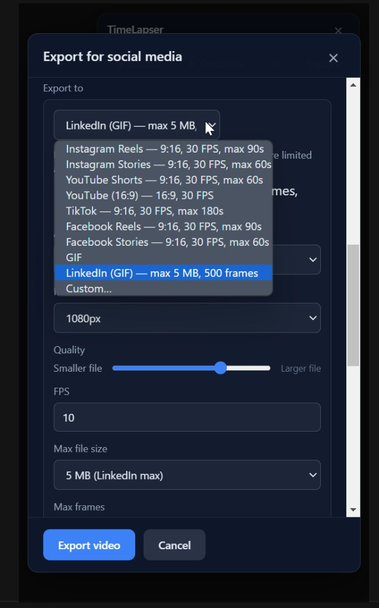
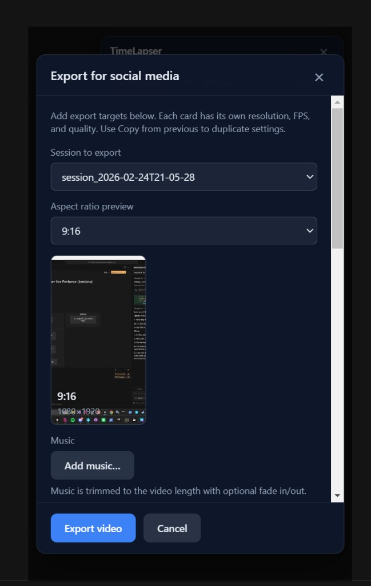

# TimeLapser

Desktop timelapse recorder: capture your monitor, a window, or a region at set intervals, with session management and export to social media formats.

## Screenshots

| Overlay (Record / Pause / Stop) | Export dialog (session + presets) |
|--------------------------------|-----------------------------------|
|  |  |

_Add your own screenshots to the `screenshots/` folder and they will appear here. Suggested: overlay bar, export dialog, region picker._

## Features

- **Capture source**: Full monitor (choose which one), or a custom region (crop rectangle).
- **Settings**: Time interval, output folder, resolution, image format (PNG/JPEG), and file size optimization (compression).
- **Sessions**: Each recording is one session. Pause keeps the same session; Stop or quitting starts a new session next time. Option to "Continue" into the last session.
- **Overlay**: Compact bar with Record / Pause / Stop and expandable settings. Always on top.
- **Notifications**: Option to open Windows Focus assist to reduce interruptions during recording.
- **Export**: Convert any session to video (MP4, WebM, or MOV) or **GIF**. Choose from a **session selector** (all sessions in the output folder). Each export target has its own **video format** (MP4/WebM/MOV) or can be **GIF** with aspect ratio (16:9 or 9:16), max dimension (480/720/1080/Full), quality, FPS, and max file size. Use **presets** for Instagram Reels/Stories, YouTube/Shorts, TikTok, and Facebook Reels/Stories, or **Custom** resolution/FPS. Add **multiple export targets** in one go. Video options: **crop to fit** aspect per preset, **speed up to fit** platform max duration, **aspect ratio preview** (9:16 or 16:9), optional background music and fade in/out, quality and max file size.

## Requirements

- **Windows** (tested on 10/11)
- **Node.js** 18+ (for development only)
- **FFmpeg**: Used for export to video. The app bundles a copy via `@ffmpeg-installer/ffmpeg`, so you don’t need to install it for the built app. If the bundled copy isn’t available (e.g. in some dev setups), install from [ffmpeg.org](https://ffmpeg.org/) or run `winget install FFmpeg`. FFmpeg is licensed under the [GPL v2+](https://www.gnu.org/licenses/old-licenses/gpl-2.0.html) / [LGPL](https://www.gnu.org/licenses/old-licenses/lgpl-2.1.html); source and license details: [ffmpeg.org/legal.html](https://ffmpeg.org/legal.html).

## Setup

```bash
npm install
```

## Run (development)

1. Build the Electron main process and start the dev server:

```bash
npm run build:electron
npm run dev
```

2. In another terminal:

```bash
npm run electron
```

Or use a single command (builds electron, runs Vite, then launches Electron when the app is ready):

```bash
npm run build:electron && npm run electron:dev
```

## Build (production)

```bash
npm run build
npm run electron
```

To package an installer:

```bash
npm run dist
```

Output is in `release/`.

## Usage

1. **Record**: Click **● Record** to start a new session. Frames are saved under the output folder in `session_YYYY-MM-DDTHH-mm-ss`.
2. **Pause / Resume**: Use **⏸ Pause** and **▶ Resume** within the same session.
3. **Stop**: **■ Stop** ends the session; the next Record will create a new session unless you use **▶ Continue**.
4. **Continue**: If you stopped or quit, **▶ Continue** appends to the last session folder.
5. **Export**: After stopping (or from the overlay while recording), use **Export** to open the export dialog. Select a session (or use the one just stopped), add one or more export targets. For each target choose a preset (e.g. Instagram Reels, YouTube Shorts, **GIF**, or Custom), set **video format** (MP4/WebM/MOV) for video or **GIF options** (aspect ratio, max dimension, quality, max file size), then export.

## Social platform limits (used for export)

| Platform           | Max duration | Aspect | Resolution   |
|--------------------|-------------|--------|--------------|
| Instagram Reels    | 90 s        | 9:16   | 1080×1920    |
| Instagram Stories  | 60 s        | 9:16   | 1080×1920    |
| YouTube Shorts     | 60 s        | 9:16   | 1080×1920    |
| YouTube (standard) | —           | 16:9   | 1920×1080    |
| TikTok             | 180 s       | 9:16   | 1080×1920    |
| Facebook Reels     | 90 s        | 9:16   | 1080×1920    |
| Facebook Stories   | 60 s        | 9:16   | 1440×2560    |

## Third-party

- **FFmpeg** ([ffmpeg.org](https://ffmpeg.org)) is used for video encoding on export. This software uses code from the FFmpeg project, licensed under the GPL v2+ / LGPL. FFmpeg source and full legal information: [ffmpeg.org/legal.html](https://ffmpeg.org/legal.html).

## License

GPL-3.0-only. See [LICENSE](LICENSE).
